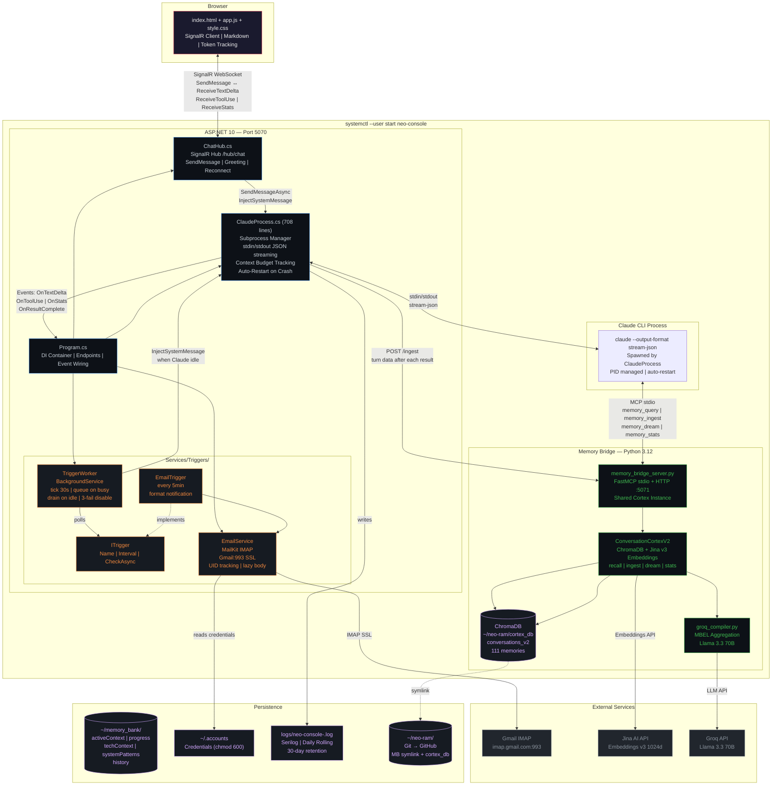
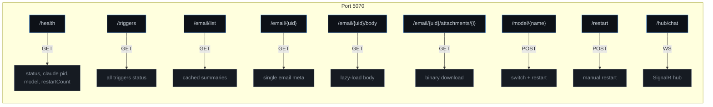
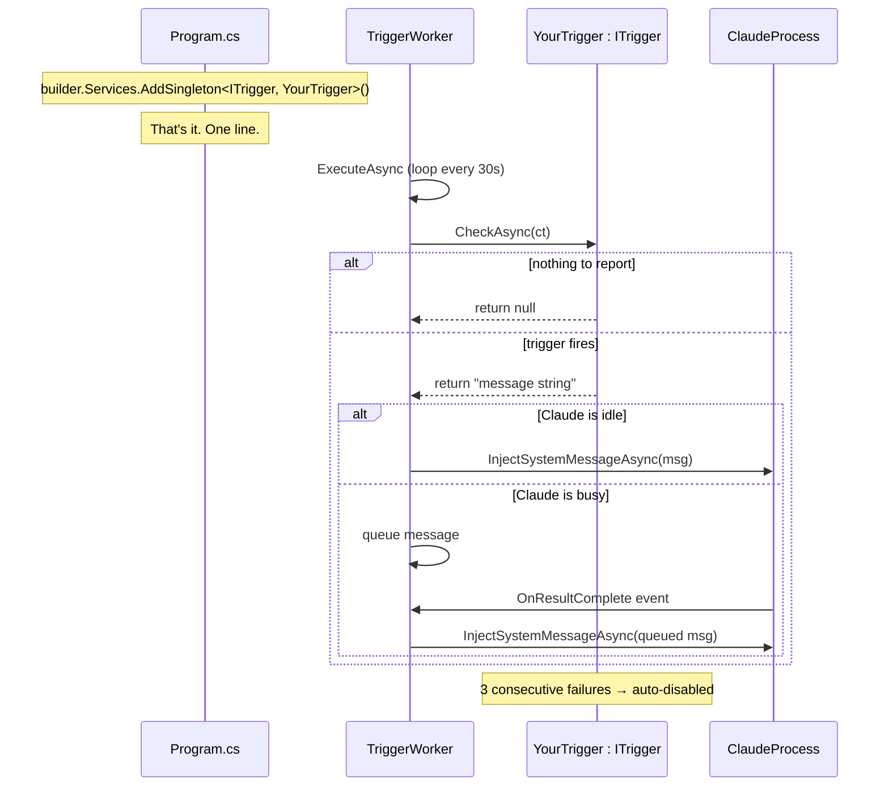
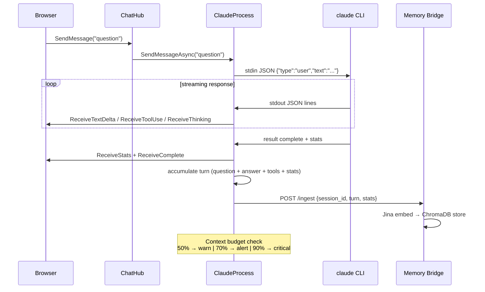
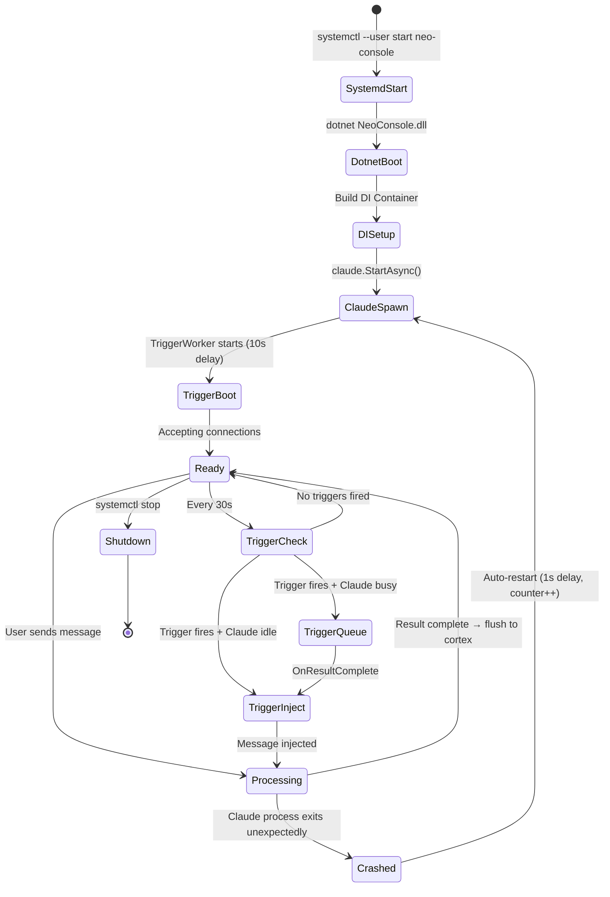

# Neo-Console Architecture

## System Overview

```mermaid
graph TB
    subgraph BROWSER["Browser"]
        UI["index.html + app.js + style.css<br/>SignalR Client | Markdown | Token Tracking"]
    end

    subgraph SYSTEMD["systemctl --user start neo-console"]
        subgraph DOTNET["ASP.NET 10 — Port 5070"]
            PROGRAM["Program.cs<br/>DI Container | Endpoints | Event Wiring"]
            HUB["ChatHub.cs<br/>SignalR Hub /hub/chat<br/>SendMessage | Greeting | Reconnect"]
            CLAUDE["ClaudeProcess.cs (708 lines)<br/>Subprocess Manager<br/>stdin/stdout JSON streaming<br/>Context Budget Tracking<br/>Auto-Restart on Crash"]

            subgraph TRIGGERS["Services/Triggers/"]
                ITRIGGER["ITrigger<br/>Name | Interval | CheckAsync"]
                WORKER["TriggerWorker<br/>BackgroundService<br/>tick 30s | queue on busy<br/>drain on idle | 3-fail disable"]
                EMAIL_T["EmailTrigger<br/>every 5min<br/>format notification"]
                EMAIL_S["EmailService<br/>MailKit IMAP<br/>Gmail:993 SSL<br/>UID tracking | lazy body"]
            end
        end

        subgraph CLAUDE_CLI["Claude CLI Process"]
            REPL["claude --output-format stream-json<br/>Spawned by ClaudeProcess<br/>PID managed | auto-restart"]
        end

        subgraph MEMORY_BRIDGE["Memory Bridge — Python 3.12"]
            MCP_SERVER["memory_bridge_server.py<br/>FastMCP stdio + HTTP :5071<br/>Shared Cortex Instance"]
            CORTEX["ConversationCortexV2<br/>ChromaDB + Jina v3 Embeddings<br/>recall | ingest | dream | stats"]
            GROQ["groq_compiler.py<br/>MBEL Aggregation<br/>Llama 3.3 70B"]
            CHROMA[("ChromaDB<br/>~/neo-ram/cortex_db<br/>conversations_v2<br/>111 memories")]
        end
    end

    subgraph EXTERNAL["External Services"]
        GMAIL["Gmail IMAP<br/>imap.gmail.com:993"]
        JINA["Jina AI API<br/>Embeddings v3 1024d"]
        GROQ_API["Groq API<br/>Llama 3.3 70B"]
    end

    subgraph STORAGE["Persistence"]
        MB[("~/memory_bank/<br/>activeContext | progress<br/>techContext | systemPatterns<br/>history")]
        ACCOUNTS["~/.accounts<br/>Credentials (chmod 600)"]
        LOGS["logs/neo-console-.log<br/>Serilog | Daily Rolling<br/>30-day retention"]
        NEORAM[("~/neo-ram/<br/>Git → GitHub<br/>MB symlink + cortex_db")]
    end

    %% Browser ↔ Server
    UI <-->|"SignalR WebSocket<br/>SendMessage ↔ ReceiveTextDelta<br/>ReceiveToolUse | ReceiveStats"| HUB

    %% Internal wiring
    PROGRAM --> HUB
    PROGRAM --> CLAUDE
    PROGRAM --> WORKER
    PROGRAM --> EMAIL_S
    HUB -->|"SendMessageAsync<br/>InjectSystemMessage"| CLAUDE

    %% Claude process
    CLAUDE <-->|"stdin/stdout<br/>stream-json"| REPL
    CLAUDE -->|"POST /ingest<br/>turn data after each result"| MCP_SERVER
    CLAUDE -->|"Events: OnTextDelta<br/>OnToolUse | OnStats<br/>OnResultComplete"| PROGRAM

    %% Trigger pipeline
    WORKER -->|"polls"| ITRIGGER
    EMAIL_T -.->|"implements"| ITRIGGER
    EMAIL_T --> EMAIL_S
    WORKER -->|"InjectSystemMessage<br/>when Claude idle"| CLAUDE

    %% Memory bridge internals
    REPL <-->|"MCP stdio<br/>memory_query | memory_ingest<br/>memory_dream | memory_stats"| MCP_SERVER
    MCP_SERVER --> CORTEX
    CORTEX --> GROQ
    CORTEX --> CHROMA

    %% External
    EMAIL_S -->|"IMAP SSL"| GMAIL
    CORTEX -->|"Embeddings API"| JINA
    GROQ -->|"LLM API"| GROQ_API

    %% Storage
    CORTEX --> CHROMA
    CHROMA -.->|"symlink"| NEORAM
    CLAUDE -->|"writes"| LOGS
    EMAIL_S -->|"reads credentials"| ACCOUNTS

    %% Styling
    classDef browser fill:#1a1a2e,stroke:#e94560,color:#eee
    classDef dotnet fill:#0d1117,stroke:#58a6ff,color:#c9d1d9
    classDef trigger fill:#161b22,stroke:#f0883e,color:#f0883e
    classDef python fill:#0d1117,stroke:#3fb950,color:#3fb950
    classDef external fill:#21262d,stroke:#8b949e,color:#8b949e
    classDef storage fill:#161b22,stroke:#d2a8ff,color:#d2a8ff

    class UI browser
    class PROGRAM,HUB,CLAUDE dotnet
    class ITRIGGER,WORKER,EMAIL_T,EMAIL_S trigger
    class MCP_SERVER,CORTEX,GROQ python
    class GMAIL,JINA,GROQ_API external
    class MB,ACCOUNTS,LOGS,NEORAM,CHROMA storage
```

## REST Endpoints

```mermaid
graph LR
    subgraph "Port 5070"
        H["/health"] -->|GET| H_R["status, claude pid,<br/>model, restartCount"]
        T["/triggers"] -->|GET| T_R["all triggers status"]
        EL["/email/list"] -->|GET| EL_R["cached summaries"]
        EU["/email/{uid}"] -->|GET| EU_R["single email meta"]
        EB["/email/{uid}/body"] -->|GET| EB_R["lazy-load body"]
        EA["/email/{uid}/attachments/{i}"] -->|GET| EA_R["binary download"]
        M["/model/{name}"] -->|POST| M_R["switch + restart"]
        R["/restart"] -->|POST| R_R["manual restart"]
        HC["/hub/chat"] -->|WS| HC_R["SignalR hub"]
    end

    classDef ep fill:#0d1117,stroke:#58a6ff,color:#c9d1d9
    classDef res fill:#161b22,stroke:#8b949e,color:#8b949e
    class H,T,EL,EU,EB,EA,M,R,HC ep
    class H_R,T_R,EL_R,EU_R,EB_R,EA_R,M_R,R_R,HC_R res
```

## Trigger Pipeline — How to Add New Triggers

```mermaid
sequenceDiagram
    participant P as Program.cs
    participant W as TriggerWorker
    participant T as YourTrigger : ITrigger
    participant C as ClaudeProcess

    Note over P: builder.Services.AddSingleton<ITrigger, YourTrigger>()
    Note over P: That's it. One line.

    W->>W: ExecuteAsync (loop every 30s)
    W->>T: CheckAsync(ct)
    alt nothing to report
        T-->>W: return null
    else trigger fires
        T-->>W: return "message string"
        alt Claude is idle
            W->>C: InjectSystemMessageAsync(msg)
        else Claude is busy
            W->>W: queue message
            C->>W: OnResultComplete event
            W->>C: InjectSystemMessageAsync(queued msg)
        end
    end

    Note over T: 3 consecutive failures → auto-disabled
```

## Data Flow — One Chat Turn

```mermaid
sequenceDiagram
    participant B as Browser
    participant H as ChatHub
    participant C as ClaudeProcess
    participant R as claude CLI
    participant M as Memory Bridge

    B->>H: SendMessage("question")
    H->>C: SendMessageAsync("question")
    C->>R: stdin JSON {"type":"user","text":"..."}

    loop streaming response
        R->>C: stdout JSON lines
        C->>B: ReceiveTextDelta / ReceiveToolUse / ReceiveThinking
    end

    R->>C: result complete + stats
    C->>B: ReceiveStats + ReceiveComplete

    C->>C: accumulate turn (question + answer + tools + stats)
    C->>M: POST /ingest {session_id, turn, stats}
    M->>M: Jina embed → ChromaDB store

    Note over C: Context budget check<br/>50% → warn | 70% → alert | 90% → critical
```

## Process Lifecycle

```mermaid
stateDiagram-v2
    [*] --> SystemdStart: systemctl --user start neo-console

    SystemdStart --> DotnetBoot: dotnet NeoConsole.dll
    DotnetBoot --> DISetup: Build DI Container
    DISetup --> ClaudeSpawn: claude.StartAsync()
    ClaudeSpawn --> TriggerBoot: TriggerWorker starts (10s delay)
    TriggerBoot --> Ready: Accepting connections

    Ready --> Processing: User sends message
    Processing --> Ready: Result complete → flush to cortex

    Ready --> TriggerCheck: Every 30s
    TriggerCheck --> Ready: No triggers fired
    TriggerCheck --> TriggerInject: Trigger fires + Claude idle
    TriggerInject --> Processing: Message injected
    TriggerCheck --> TriggerQueue: Trigger fires + Claude busy
    TriggerQueue --> TriggerInject: OnResultComplete

    Processing --> Crashed: Claude process exits unexpectedly
    Crashed --> ClaudeSpawn: Auto-restart (1s delay, counter++)

    Ready --> Shutdown: systemctl stop
    Shutdown --> [*]
```
